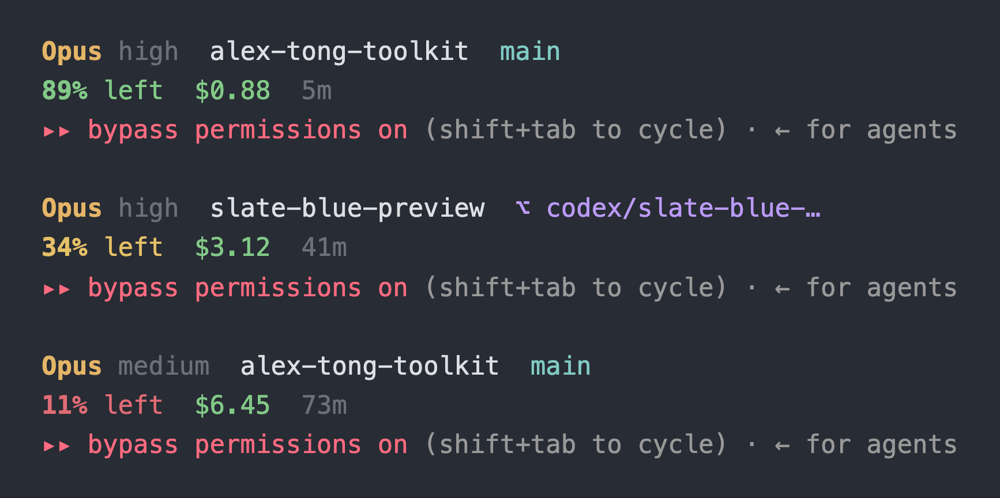

## What it does

It swaps Claude Code's default status line for two short lines at the bottom of your terminal:

- **Line 1** is the model, the effort level, the project folder and the git branch. When you're in a worktree, the branch turns purple with a `⌥` in front of it, so you always know which copy of the repo you're editing.
- **Line 2** is how much of the context window is left, what the session has cost so far, and how long it's been running.

The context number changes color as it drops: green above 50%, amber above 20%, red below that. Each piece only shows up once Claude Code reports it, so a fresh session stays quiet.

## When to reach for it

The context number is the reason it exists. When you know you're at 12% before Claude starts forgetting what you told it forty messages ago, you get to compact or restart on purpose instead of getting compacted by surprise. When it goes red, that's the moment to run [fresh](https://alextong.me/toolkit/fresh).

The branch is the other reason. If you run more than one session, or work in worktrees, one glance tells you which tree this session is changing.

## What it touches

- **Reads** the session state Claude Code pipes in on every render, and your git branch in the current folder.
- **Reads** the end of the session's own transcript file, only when Claude Code doesn't report the effort level directly.
- **Writes** one file: at every session start, a hook copies the script to `~/.claude/plugins/data/statusline-alex-tong-toolkit/statusline-command.sh`. That folder survives plugin updates, which is how an update reaches your status line. The hook never touches your `settings.json`. No network calls.
- **Needs** bash and `jq`. Recent macOS already ships `jq`.
- **Changes** one key in `~/.claude/settings.json`, `statusLine`, and only when you run `/statusline:setup` and say yes. A plugin can't set your status line itself, so this command does it. It backs up the file first, never prints it, and `/statusline:setup remove` takes the key out again.
- It's one bash script with the colors in a block at the top, so every color, threshold and piece of it is yours to change.

## It's working if

- Two lines show at the bottom of Claude Code a few seconds after `/statusline:setup` finishes.
- The context percentage drops as the session goes on, and changes color at 50% and 20%.
- You see the folder and branch but no model and an empty second line: that means `jq` is missing.
